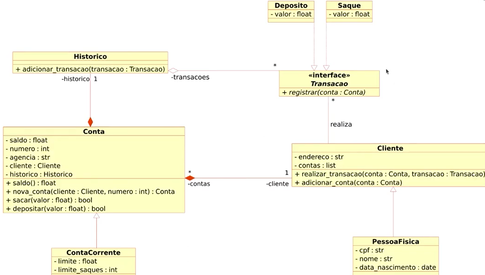

# 🏦 Sistema Bancário

Bem-vindo ao projeto **Sistema Bancário**! Fomos contratados por um grande banco para modernizar suas operações e escolhemos a linguagem Python para desenvolver esse novo sistema. Vamos juntos nessa missão? 🚀

## 📋 Descrição

Este projeto tem como objetivo criar a primeira versão de um sistema bancário com funcionalidades básicas de depósito, saque e extrato. A implementação do código seguiram o seguinte modelo de classes UML:

    
     
    <em>Figura 1: Modelo de classes</em>

Vamos explorar cada uma dessas operações:

- 💰 Depósito:
    - Deve ser possível depositar valores positivos na conta bancária.
    - A v1 do projeto trabalha apenas com 1 usuário, portanto, não precisamos identificar o número da agência e conta bancária.
    - Todos os depósitos devem ser armazenados e exibidos na operação de extrato.

- 🏧 Saque
    - O sistema deve permitir realizar até 3 saques diários, com limite máximo de R$ 500,00 por saque.
    - Caso o usuário não tenha saldo suficiente, o sistema exibirá uma mensagem informando a impossibilidade de sacar o dinheiro por falta de saldo.
    - Todos os saques devem ser armazenados e exibidos na operação de extrato.

- 📜 Extrato
    - Essa operação deve listar todos os depósitos e saques realizados na conta.
    - No fim da listagem, deve ser exibido o saldo atual da conta.
    - Se o extrato estiver em branco, exibir a mensagem: "Não foram realizadas movimentações".

## 🛠️ Tecnologias Utilizadas

- Python 3.x

## Referências 
[DIO: Python AI Backend Developer](https://web.dio.me/track/70304c16-a7d8-4066-97de-16345e1653a6)

